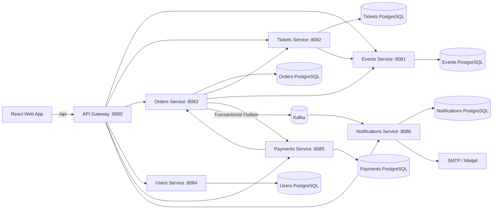

# TicketFlow

TicketFlow is a full-stack event ticketing platform built around a microservices architecture. It covers the complete ticket lifecycle: venue and event management, inventory and pricing, reservations, checkout and payments, ticket issuance, QR-based admission, notifications, refunds, transfers, promotions, analytics, and administrative operations.

The project is designed as both a functional ticketing system and a practical reference for building distributed applications with Kotlin/Ktor, PostgreSQL, Kafka, React, and Docker.

## Highlights

- Public event catalog and event detail pages.
- Reserved seating and general-admission inventory.
- Persistent cart with reservation expiration.
- Backend-authoritative pricing and order totals.
- Multiple pricing tiers, presales, and sales windows.
- Promotion and coupon support.
- Simulated payments for development and optional Stripe checkout.
- Full and partial refunds.
- QR ticket generation with HMAC signatures.
- PDF ticket generation with JasperReports.
- Ticket transfer between users.
- Staff/Admin ticket check-in with duplicate-scan protection and audit data.
- Purchase confirmation emails and in-app notifications.
- Event sales, revenue, occupancy, and check-in analytics.
- Venue, section, seat, and seating-map administration.
- JWT authentication with rotating refresh tokens.
- CUSTOMER, STAFF, and ADMIN roles.
- Transactional Outbox + Kafka for post-purchase events.
- Prometheus metrics and Grafana-ready observability stack.

## Architecture



Each business service owns its own PostgreSQL database. Services do not share database tables; cross-domain operations use HTTP APIs or asynchronous Kafka events.

## Services

| Service | Port | Responsibility |
| --- | ---: | --- |
| API Gateway | `8080` | Public `/api` entry point and routing to backend services |
| Events Service | `8081` | Venues, sections, seats, seating coordinates, events and event lifecycle |
| Tickets Service | `8082` | Inventory, reservations, GA capacity, section pricing and pricing tiers |
| Orders Service | `8083` | Cart/order workflow, promotions, issued tickets, transfers, QR/PDF tickets, check-in and analytics |
| Users Service | `8084` | Registration, authentication, users, roles and refresh-token sessions |
| Payments Service | `8085` | Checkout, simulated/Stripe payments and refunds |
| Notifications Service | `8086` | In-app notifications, Kafka consumption and purchase emails |

Supporting infrastructure:

| Component | Port | Purpose |
| --- | ---: | --- |
| Kafka | `9092` | Asynchronous domain events |
| Redis | `6379` | Infrastructure dependency available to the platform |
| Mailpit | `8025` | Development email inbox |
| Mailpit SMTP | `1025` | Development SMTP server |
| Prometheus | `9090` | Metrics collection |
| Grafana | `3000` | Metrics visualization |

PostgreSQL is exposed locally on ports `5433` through `5438`, with one database per service.

## Technology Stack

### Backend

- Kotlin 2.4
- Ktor
- Kotlinx Serialization
- JetBrains Exposed
- PostgreSQL 17
- Flyway
- Kafka 4.1
- JWT authentication
- ZXing for QR generation
- JasperReports for ticket PDFs
- Gradle

### Frontend

- React 19
- TypeScript 6
- Vite 8
- React Router 7
- TanStack Query 5
- `html5-qrcode` for mobile/browser QR scanning

### Infrastructure

- Docker / Docker Compose
- Apache Kafka
- Redis
- Mailpit
- Prometheus
- Grafana

## Project Structure

```text
ticketflow/
├── docker-compose.yml
├── infrastructure/
│   └── prometheus/
│       └── prometheus.yml
├── services/
│   ├── api-gateway/
│   ├── events-service/
│   ├── tickets-service/
│   ├── orders-service/
│   ├── users-service/
│   ├── payments-service/
│   └── notifications-service/
└── web/
    ├── src/
    ├── public/
    ├── package.json
    └── vite.config.ts
```

## Core Domain Flow

A normal purchase follows this flow:

1. A customer browses a published event.
2. TicketFlow loads event inventory from Tickets Service.
3. The customer selects reserved seats, general-admission tickets, or a combination of both.
4. Orders Service creates the active order/cart and asks Tickets Service to reserve the selected inventory.
5. Reservations receive an expiration time. Expired reservations are automatically released.
6. Pricing, promotions, and totals are calculated by the backend.
7. Checkout creates a payment through Payments Service.
8. After successful payment, Orders Service confirms the order and issues tickets.
9. A domain event is persisted through the Transactional Outbox and published to Kafka.
10. Notifications Service consumes the event and creates the purchase notification/email.
11. The customer can view the ticket, display its signed QR code, or download its PDF.
12. STAFF or ADMIN users can scan the QR code at the venue. Check-in atomically changes the ticket from `ISSUED` to `USED` and records audit information.

## Event and Inventory Model

TicketFlow supports two primary section types:

- `RESERVED_SEATING` — inventory is associated with individual seats.
- `GENERAL_ADMISSION` — inventory represents capacity rather than a specific seat.

Events follow a lifecycle that includes `DRAFT`, `PUBLISHED`, `CANCELLED`, and `FINISHED` states. Publishing is guarded by inventory readiness so an event cannot be exposed to customers without sellable inventory.

The platform also supports section pricing, multiple pricing tiers, priority, presale configuration, and sale start/end windows.

## Ticket Lifecycle

Issued tickets use the following primary states:

```text
ISSUED -> USED
   |
   -> CANCELLED
```

Each ticket receives a unique admission token and a signed QR payload. The signature is generated server-side using HMAC-SHA256 so admission does not rely on a user-editable identifier alone.

Check-in validates the signed payload and performs an atomic state transition, preventing the same ticket from being admitted twice.

## Authentication and Authorization

TicketFlow uses JWT access tokens together with persistent rotating refresh tokens.

Roles:

| Role | Access |
| --- | --- |
| `CUSTOMER` | Catalog, cart, checkout, orders, tickets, transfers and notifications |
| `STAFF` | Operational ticket check-in |
| `ADMIN` | Full administration, users, events, venues, inventory, commerce, analytics and check-in |

Refresh tokens are persisted as hashes and delivered through an HttpOnly cookie. Access tokens are short-lived and the frontend can restore the authenticated session through the refresh flow.

## Commerce Features

The current commerce layer includes:

- Persistent active cart/order.
- Mixed reserved-seat and general-admission purchases.
- Reservation TTL and automatic expiration.
- Backend price snapshots.
- Advanced pricing tiers and sale windows.
- Promotion codes with percentage/fixed discounts.
- Event-specific promotions.
- Global and per-user promotion limits.
- Simulated checkout for local development.
- Stripe provider integration hooks.
- Full and partial refunds.
- Per-ticket cancellation/refund flows.
- Ticket transfers between users.
- Sales, refund, revenue, occupancy and check-in analytics.

## Running the Project

### Requirements

For the standard development setup you need:

- Docker with Docker Compose
- Node.js and npm for the React frontend

A local JDK is only required if you want to run or build Ktor services outside Docker.

### 1. Start backend infrastructure and services

From the repository root:

```bash
docker compose up -d --build
```

Check service status:

```bash
docker compose ps
```

View logs:

```bash
docker compose logs -f
```

Flyway migrations run as part of service startup and maintain each service's database schema independently.

> The PostgreSQL databases use named Docker volumes. Avoid `docker compose down -v` unless you intentionally want to delete local development data.

### 2. Start the frontend

```bash
cd web
npm install
npm run dev
```

The Vite development server runs on:

```text
http://localhost:5174
```

The frontend uses `/api` as its application API path. Vite proxies `/api/*` to the API Gateway at `http://localhost:8080` without removing the `/api` prefix.

### 3. Open development tools

- Web application: `http://localhost:5174`
- API Gateway: `http://localhost:8080`
- Mailpit: `http://localhost:8025`
- Prometheus: `http://localhost:9090`
- Grafana: `http://localhost:3000`

## Environment Configuration

Docker Compose includes development defaults for most settings. Secrets must be replaced for any environment beyond local development.

Common configuration values include:

```env
JWT_SECRET=replace-with-a-strong-secret
INTERNAL_SERVICE_SECRET=replace-with-a-strong-internal-secret
TICKET_QR_SECRET=replace-with-a-strong-qr-secret

PAYMENT_PROVIDER=SIMULATED
STRIPE_SECRET_KEY=
STRIPE_WEBHOOK_SECRET=

WEB_BASE_URL=http://localhost:5174
```

`PAYMENT_PROVIDER` can be `SIMULATED` for local development or configured for the Stripe provider when Stripe credentials and webhook handling are available.

Never deploy with the development JWT, internal-service, database, or QR signing secrets from `docker-compose.yml`.

## Frontend Routes

Customer-facing routes include:

```text
/events
/events/:eventId
/cart
/checkout
/checkout/success
/checkout/cancel
/orders
/tickets
/tickets/:ticketId
/notifications
```

Operational and administrative routes include:

```text
/staff/check-in
/admin
/admin/venues
/admin/venues/:venueId
/admin/sections/:sectionId
/admin/events
/admin/inventory
/admin/orders
/admin/tickets
/admin/commerce
/admin/users
/admin/check-in
```

## Payments

The Payments Service supports a provider abstraction.

### Simulated provider

The default local provider is `SIMULATED`. It allows the complete purchase workflow to be exercised without an external payment processor.

### Stripe

Stripe support is configurable with:

```env
PAYMENT_PROVIDER=STRIPE
STRIPE_SECRET_KEY=...
STRIPE_WEBHOOK_SECRET=...
```

Order confirmation is based on backend payment state rather than trusting a browser redirect.

## Notifications and Email

After order confirmation, Orders Service publishes an `order confirmed` event through its Transactional Outbox. Notifications Service consumes that event from Kafka, persists the notification, and sends the purchase email through SMTP.

In local development, email is delivered to Mailpit and can be inspected at `http://localhost:8025`.

## Ticket PDFs

Ticket PDFs are generated server-side using JasperReports. The report template lives in Orders Service resources and includes ticket/event information together with the signed QR code used for admission.

## Database Migrations

Database schema changes are versioned independently per service with Flyway:

```text
services/<service>/src/main/resources/db/migration/
```

Current domains include migrations for:

- venues, sections, seats, venue time zones and seating maps;
- ticket inventory, reservations and advanced pricing;
- orders, order items, outbox events, issued tickets, reservation expiration, check-in audit and commerce features;
- users and refresh tokens;
- payments, checkout providers and partial refunds;
- notifications and event associations.

## Building

### Frontend

```bash
cd web
npm run build
```

Lint:

```bash
npm run lint
```

### Individual backend service

Each Ktor service includes its own Gradle wrapper. For example:

```bash
cd services/orders-service
./gradlew build
```

### Backend services with Docker

```bash
docker compose build \
  events-service \
  tickets-service \
  orders-service \
  users-service \
  payments-service \
  notifications-service \
  api-gateway
```

## Observability

The development environment includes Prometheus and Grafana. The backend also includes operational hardening such as request logging, security headers, service-level validation, internal service authentication, and rate limiting in sensitive flows.

## Design Principles

TicketFlow follows several architectural rules:

1. **Database per service.** A service owns its data and other services must not query its database directly.
2. **Backend authority.** Inventory, pricing, discounts, payments, ticket state and admission decisions are validated server-side.
3. **Atomic inventory operations.** Reservation and admission transitions are protected against concurrent requests.
4. **Compensating actions.** Multi-service workflows release previously reserved resources when later steps fail.
5. **Asynchronous post-commit work.** Kafka and the Transactional Outbox are used for work such as purchase notifications after the order transaction is committed.
6. **Idempotency.** Payment/refund and asynchronous processing paths are designed to tolerate retries.
7. **Role-based access.** Customer, operational staff and administration capabilities are separated.

## Development Status

TicketFlow currently implements the core end-to-end ticketing and commerce workflow, including administration, purchasing, payments, ticket issuance, admission, notifications, pricing, promotions, transfers, refunds and event analytics.

The project is under active development. Production deployment concerns such as final secret management, production SMTP/payment configuration, infrastructure scaling, deployment orchestration, deeper monitoring dashboards, and additional automated test coverage should be completed before treating the system as production-ready.

## License

No license is currently defined in this repository. Add a `LICENSE` file before distributing the project under a specific open-source or commercial license.
